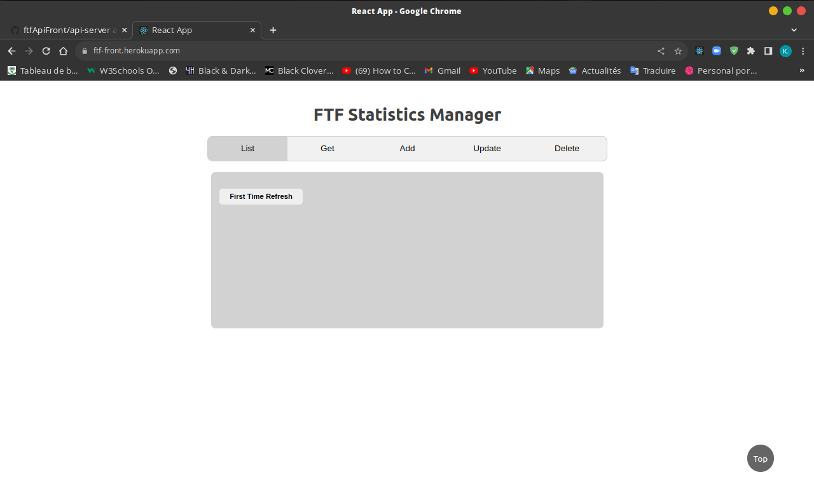
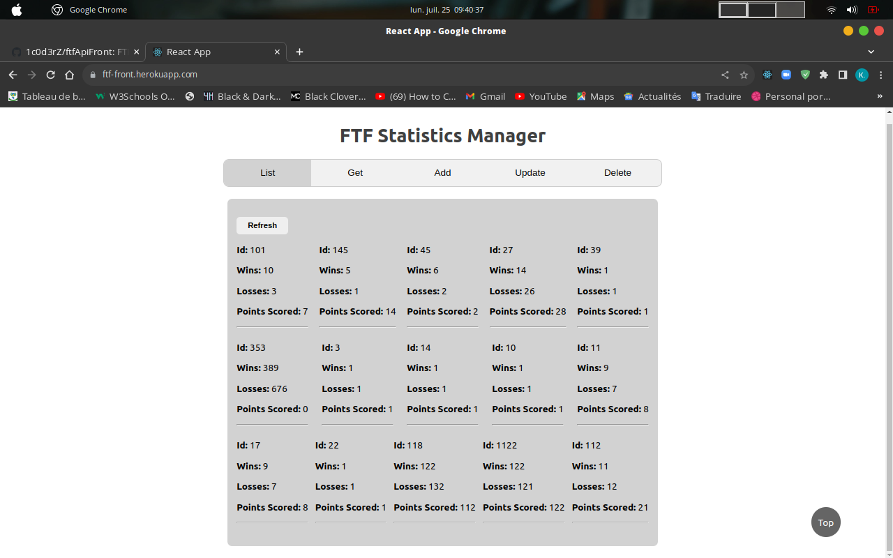

# ftfApiFront

[**FTF Api frontend**](https://ftf-front.herokuapp.com) for working with the api hosted on heroku  

#

-   **Go to [**FTF Api Website**](https://ftf-front.herokuapp.com)**

-   **Go to [**Application Documentation**](https://github.com/1c0d3rZ/ftfApiFront/tree/main/client#readme)**

-   **Go to [**Api Documentation**](https://github.com/1c0d3rZ/ftfApiFront/tree/main/api-server#readme)**
#

###   `ScreenShoots`

#

  - **`List tab`** : to list all the players statistics registered
  - **`Get tab`** : to list a specific registered player statistic
  - **`Add tab`** : to add a player statistic
  - **`Update tab`** : to update a specific registered player statistic
  - **`Delete tab`** : to delete a specific registered player statistic

#

###  Created by [CoderZ](https://github.com/1c0d3rZ)